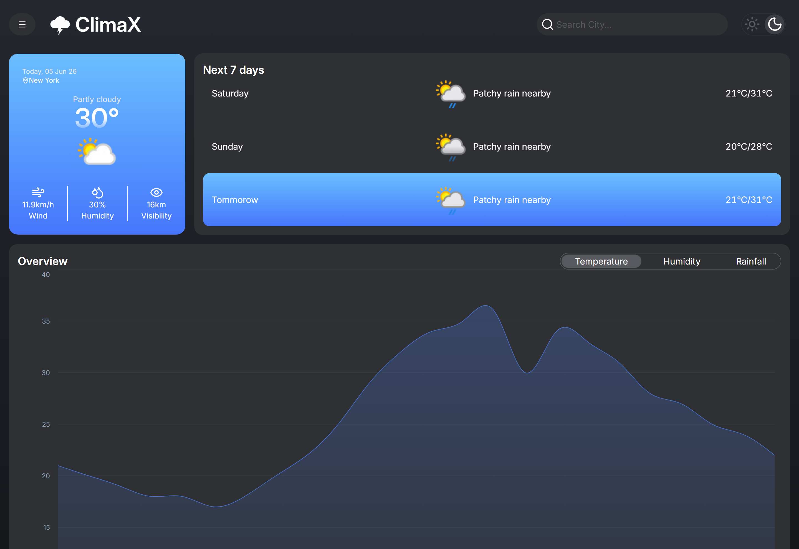
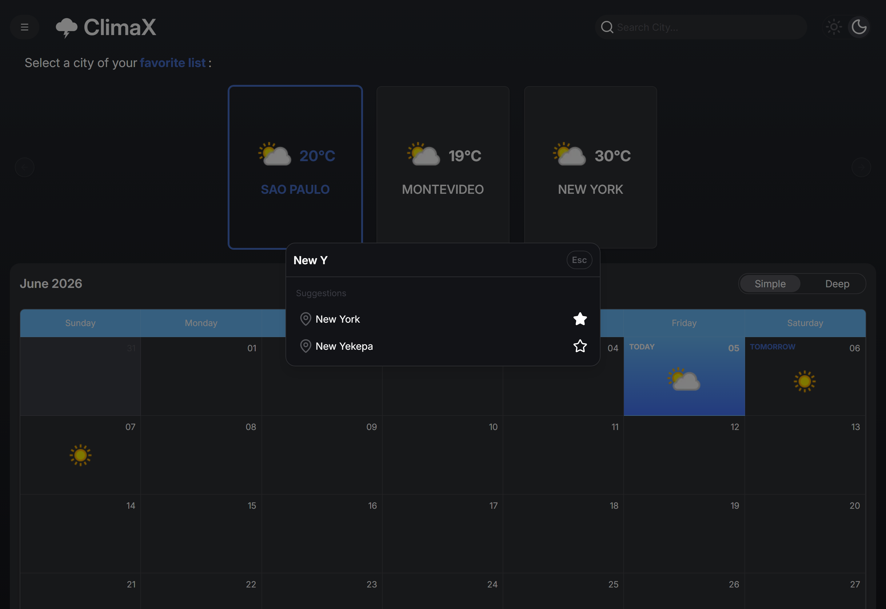

<div align="center">

# 🌤️ ClimaX

**A modern weather dashboard built with React, TypeScript, and TanStack Router + Query**


[Demo ao vivo](https://clima-x-weather-intelligence-dashbo-five.vercel.app/) · [Reportar Bug](../../issues) · [Solicitar Feature](../../issues)

</div>

---

## 📸 Screenshots





---

## ✨ Features

| Feature | Descrição |
|---|---|
| 🔍 **Busca de cidades** | Busca com debounce integrada via WeatherAPI |
| ⭐ **Favoritos persistentes** | Cidades favoritas salvas em `localStorage` com Context API |
| 📊 **Gráficos de previsão** | Forecast visual interativo com Recharts |
| 🔔 **Toast notifications** | Sistema de notificações customizado com React Context e animações via Tailwind v4 |
| 💀 **Skeleton loaders** | UX polida com skeletons durante estados de carregamento |
| 🚀 **Server state moderno** | Gerenciamento de dados assíncronos com TanStack Query v5 |
| 🗺️ **Roteamento type-safe** | Navegação file-based com TanStack Router |
| 📱 **Layout responsivo** | Interface adaptada para mobile e desktop com Tailwind CSS |
| 🧪 **Testes automatizados** | Suíte completa com Vitest + Testing Library cobrindo domínio, hooks, contexts, componentes e rotas |
---

## 🎨 Design & Prototipagem

O layout do projeto foi planejado antes da implementação. A estrutura de componentes, hierarquia de páginas e fluxo de navegação foram esboçados no [Excalidraw](https://excalidraw.com) — garantindo uma base sólida para as decisões de componentização e roteamento antes de escrever qualquer linha de código.

---

## 🏗️ Arquitetura & Decisões Técnicas

### Estrutura do projeto

```
climax/
├── src/
│   ├── assets/           # Recursos estáticos
│   ├── components/       # Componentes de UI reutilizáveis
│   ├── contexts/         # Context providers 
│   ├── domain/           # Lógica de domínio pura (calendário, mapeamento de dados para charts)
│   ├── hooks/            # Custom hooks (TanStack Query + lógica de negócio)
│   ├── lib/              # Configurações de libs externas e instâncias
│   ├── routes/           # Páginas gerenciadas pelo TanStack Router
│   ├── services/         # Camada de comunicação com a WeatherAPI
│   ├── styles/           # Estilos globais e configuração do Tailwind
│   ├── types/            # Tipos TypeScript globais
│   └── main.tsx          # Entry point da aplicação
```

### TanStack Router — roteamento file-based e type-safe

A navegação é gerenciada pelo TanStack Router com geração automática de rotas via `@tanstack/router-plugin`. Cada rota é um arquivo com seu próprio `createRootRoute` ou `createFileRoute`, mantendo layout e lógica de navegação colocalizados e com tipagem end-to-end sem configuração manual.

```ts
export const Route = createRootRoute({
  component: () => (
    <div className="...">
      <Header />
      <Outlet />
    </div>
  ),
})
```

### TanStack Query v5 — server state sem boilerplate

Toda comunicação com a WeatherAPI é gerenciada via `useQuery`, eliminando completamente o padrão `useState` + `useEffect` para dados remotos. Isso garante cache automático, deduplicação de requisições e estados de loading/error centralizados por hook.

```ts
const { data: cities, isPending } = useQuery({
  queryKey: ['citySearch', debouncedQuery],
  queryFn: () => fetchCities(debouncedQuery),
  enabled: debouncedQuery.length > 2,
})
```

> O TanStack Query v5 inicializa `data` como `undefined` (não `[]`), então todos os consumidores fazem guard com `data ?? []` antes de `.map()` para evitar erros durante o estado pendente.

### Favoritos com persistência via Context + localStorage

A feature de favoritos foi construída sem nenhuma lib de estado global externa. Um `FavoritesContext` centraliza a lista e persiste automaticamente no `localStorage`.

```ts
const { favorites, addFavorite, removeFavorite } = useFavorites()
```

### Toast notification system

Sistema de notificações construído do zero — sem dependências externas — com `ToastContext` para dispatch global e animações declaradas com `@keyframes` no `globals.css` (Tailwind v4 `@theme`). Auto-dismiss configurável por notificação.

### Classes dinâmicas no Tailwind v4

O Tailwind purga classes não encontradas literalmente no código. Para valores dinâmicos (ex: cor por condição climática), o projeto usa **static mapping objects** ao invés de template strings interpoladas:

```ts
// ❌ Classe gerada dinamicamente — será purgada em produção
const cls = `bg-${condition}-500`

// ✅ Classes existem literalmente no source — sobrevivem ao build
const conditionColorMap: Record<Condition, string> = {
  sunny: 'bg-yellow-500',
  rainy: 'bg-blue-500',
  cloudy: 'bg-gray-400',
}
```

### Testes automatizados com Vitest + React Testing Library

O projeto tem uma suíte de testes cobrindo todas as camadas da aplicação — funções de domínio puras, custom hooks (síncronos e assíncronos com TanStack Query), Context providers, componentes e rotas. A estratégia varia por camada: funções de domínio são testadas isoladamente por entrada/saída, hooks assíncronos mockam a camada de serviço (`vi.mock` + `mockImplementation`), e componentes mockam os hooks já testados individualmente, evitando duplicar cobertura entre camadas.

```ts
// Hook assíncrono: mock de service + QueryClientProvider como wrapper
const { result } = renderHook(() => useDeepForecast(selectedCity), {
  wrapper: createQueryWrapper(),
})

await waitFor(() => expect(result.current.isSuccess).toBe(true))
```

Pontos técnicos resolvidos ao longo da suíte: mock de `ResizeObserver`/`matchMedia` para componentes que dependem de medição de layout (Recharts, Embla Carousel), controle de tempo não-determinístico com `vi.useFakeTimers`/`vi.setSystemTime` para lógica de calendário e notificações com auto-dismiss, e isolamento de mocks entre testes via `vi.resetAllMocks()` no `beforeEach`.

```bash
npm run test        # modo watch
npm run test:ui     # interface visual do Vitest
```

### Camada de domínio isolada

A pasta `domain/` concentra lógica pura — sem efeitos colaterais, sem dependências de UI. O mapeamento dos dados da WeatherAPI para o formato esperado pelo Recharts acontece aqui, não dentro dos componentes. O mesmo vale para o cálculo do calendário mensal.

```ts
// Dados da API → formato do chart, em função pura e testável
export const mapWeatherToChartData = (
  data: WholeTodayWeatherType[] | undefined,
  chartType: ChartType,
) => {
  if (!data) return []
  return data.map((item) => ({
    hour: item.time,
    value: chartType === 'temp' ? item.tempC
         : chartType === 'hum'  ? item.humidity
         : item.rainfall,
  }))
}
```

Isso mantém os componentes agnósticos ao formato da API e facilita eventuais trocas de fonte de dados.

### Utilitários de estilo

`clsx` + `tailwind-merge` combinados na função `cn()` dentro de `lib/` — padrão consolidado para composição de classes condicionais sem conflitos de especificidade.

---

## 🚀 Rodando Localmente

**Pré-requisitos:** Node.js 18+ e uma chave gratuita da [WeatherAPI](https://www.weatherapi.com/)

```bash
git clone https://github.com/Drey-1/ClimaX-Weather-Intelligence-Dashboard
cd ClimaX-Weather-Intelligence-Dashboard
npm install
cp .env.example .env   # adicione sua VITE_WEATHER_API_KEY
npm run dev
```

Acesse [http://localhost:5173](http://localhost:5173)

---

## 🛠️ Tecnologias

| Tecnologia | Versão | Papel |
|---|---|---|
| [React](https://react.dev) | 19 | UI library |
| [TypeScript](https://typescriptlang.org) | 5.9 | Tipagem estática |
| [Vite](https://vitejs.dev) + SWC | 7 | Build tool e dev server |
| [TanStack Router](https://tanstack.com/router) | v1 | Roteamento file-based type-safe |
| [TanStack Query](https://tanstack.com/query) | v5 | Server state e cache |
| [Tailwind CSS](https://tailwindcss.com) | v4 | Estilização utility-first |
| [Radix UI](https://www.radix-ui.com) | — | Componentes acessíveis headless |
| [Recharts](https://recharts.org) | — | Gráficos de previsão |
| [Embla Carousel](https://embla-carousel.com) | — | Carousel responsivo |
| [Axios](https://axios-http.com) | — | Cliente HTTP |
| [date-fns](https://date-fns.org) + [dayjs](https://day.js.org) | — | Manipulação de datas |
| [Biome](https://biomejs.dev) | — | Linter e formatter |
| [WeatherAPI](https://www.weatherapi.com) | — | Dados meteorológicos |
| [Vitest](https://vitest.dev) | v4 | Test runner |
| [Testing Library](https://testing-library.com) | — | Testes de componentes e hooks |

---

## 📄 Licença

Distribuído sob a licença MIT. Veja [`LICENSE`](./LICENSE) para mais informações.

---

<div align="center">
  Feito com ☕ e TypeScript
</div>